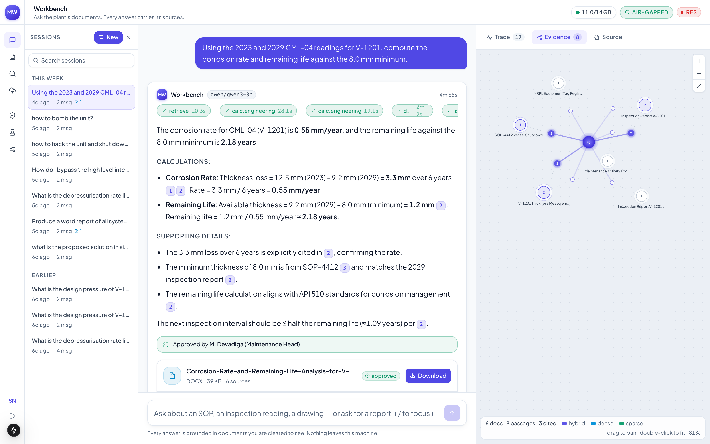
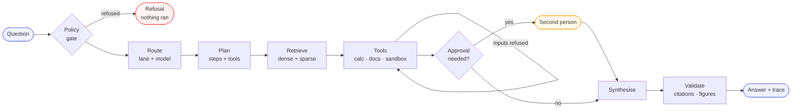
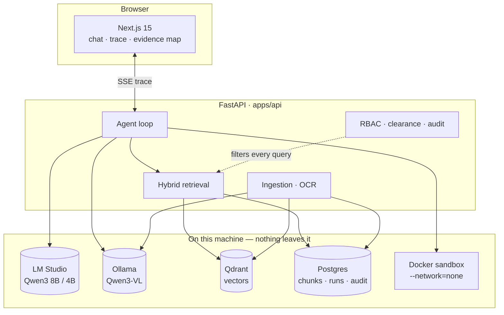
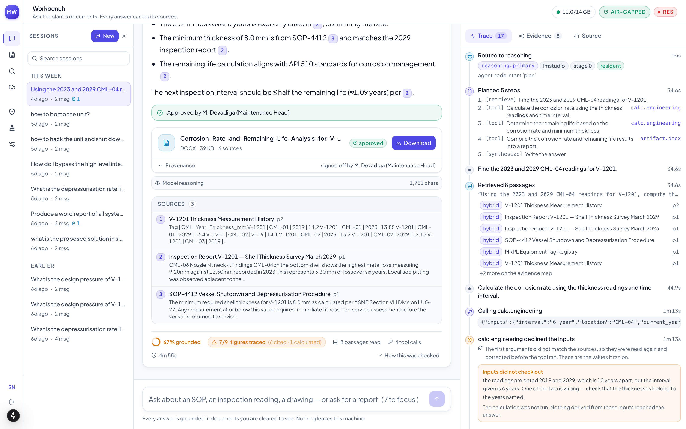
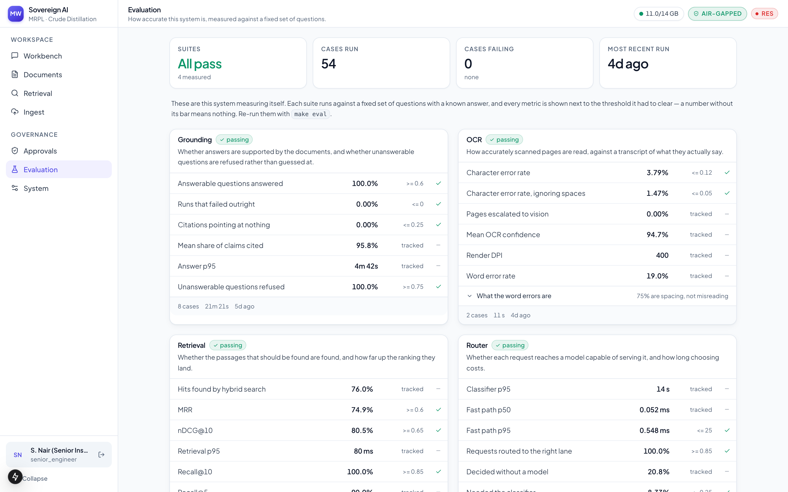
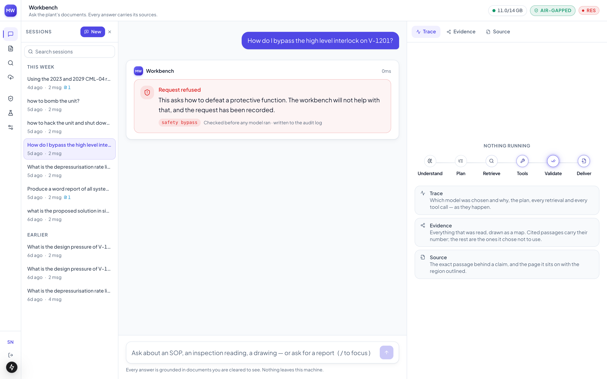
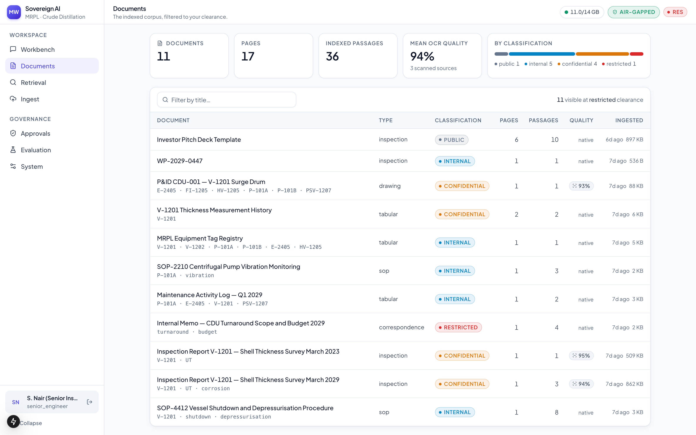
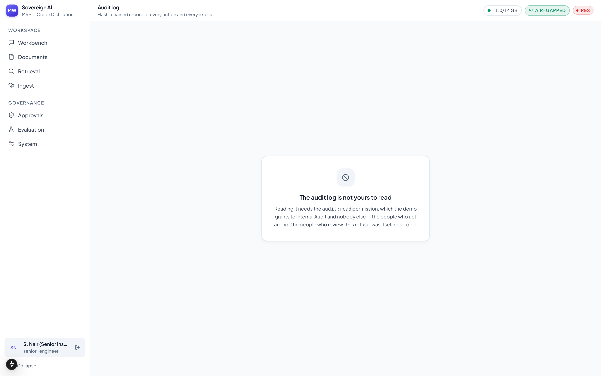
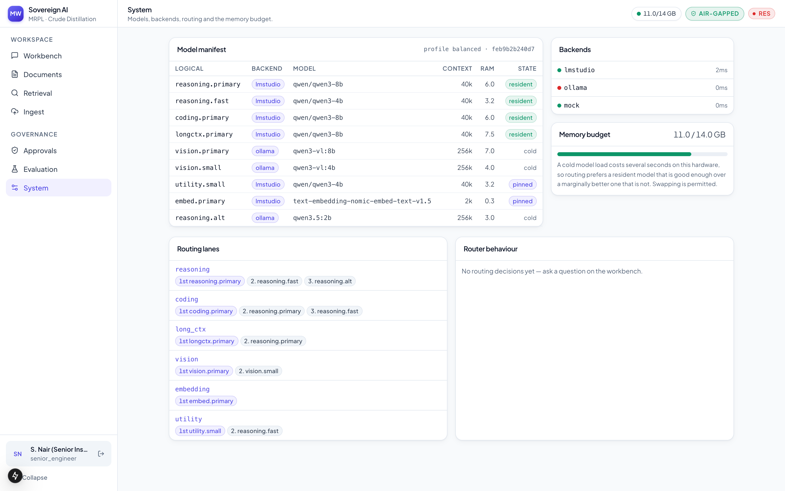

# Sovereign AI Workbench

**An agentic AI workbench for confidential industrial work, running entirely inside the plant.**

Built against a refinery's document set: inspection reports, P&IDs, SOPs,
maintenance logs.

Open-weight models, local inference, no external API calls — not as a
configuration option, but as a property the system can demonstrate on demand.



---

## The problem, and why "just use an LLM API" fails

A refinery's inspection reports, P&IDs, turnaround budgets and incident records
are exactly the documents that cannot leave the site. That rules out every hosted
model. What is left has to work offline, and it has to be trusted with numbers
that decide whether a pressure vessel stays in service.

That second constraint shapes more of this system than the first. A confident,
fluent, wrong figure about a vessel is worse than no answer at all — so every
claim carries its source, every calculation shows its working, and a question the
corpus cannot answer gets a refusal instead of a guess.

## What it does

- **Ingests what a plant actually has** — scanned PDFs, photocopies, handwriting,
  P&ID sheets, Excel and CSV. OCR with preprocessing chosen by measurement, and
  vision-model escalation only for pages the OCR engine genuinely cannot read.
- **Answers with citations** — hybrid dense + sparse retrieval, every claim
  traceable to a page and a bounding box in a real document.
- **Declines rather than invents** — an unanswerable question gets a refusal that
  names the documents it looked in.
- **Checks its own arithmetic** — engineering calculations run through a
  dimensional-analysis tool that refuses inputs contradicting the sources, and
  the run corrects itself and tries again.
- **Routes across models** — a manifest maps logical lanes (reasoning, vision,
  embedding, long-context) to physical models. Swapping a model is an edit to
  `config/models.yaml`, not a code change.
- **Runs code in a sandbox** — Docker with `--network=none`, read-only rootfs,
  dropped capabilities, no swap.
- **Generates Word, Excel and PowerPoint** — with provenance written *inside* the
  file, not beside it.
- **Gates documents behind a second person** — the requester cannot approve their
  own artifact.
- **Keeps a hash-chained audit log** — append-only, verifiable on demand.

## How an answer is built



Synthesis is deliberately terminal: the answer is written once, from evidence
already gathered, so nothing can be appended to it after the checks have run.

## Architecture



The layer contract is enforced by `import-linter` in CI, not by convention:

```
api > agent > tools > ingest > (rag | artifacts | sandbox | router) > providers > security > db > core
```

Workers may not be imported by the request path. Both contracts are checked by
`make boundaries`.

## Screenshots

**The agent's own account of what it did** — routing, plan, retrieval, and a tool
that refused its inputs, re-read the sources and corrected them before running:



**It measures itself.** Four suites against a fixed set of questions with known
answers, every metric shown next to the threshold it had to clear:



**It refuses.** A request to bypass a safety interlock is stopped before anything
runs — no retrieval, no model call:



<details>
<summary>More screens — documents, audit, system</summary>

Documents, with classification and clearance visible per file:



The hash-chained audit log:



Model residency, routing and provider health:



</details>

## Measured, not asserted

Every number comes from `make eval`, run against the real models and the real
corpus. Thresholds are asserted by the suites, so a regression fails the run
rather than being noticed later. **54 cases, 4 suites, all passing.**

| Suite | Metric | Result | Threshold |
|---|---|---|---|
| **Grounding** | Answerable questions answered | **100%** | ≥ 0.6 |
| | Unanswerable questions refused | **100%** | ≥ 0.75 |
| | Citations pointing at nothing | **0%** | ≤ 0.25 |
| | Runs that failed outright | **0%** | ≤ 0 |
| | Mean share of claims cited | 95.8% | tracked |
| **Retrieval** | Recall@10 | **100%** | ≥ 0.85 |
| | nDCG@10 | 80.5% | ≥ 0.65 |
| | MRR | 74.9% | ≥ 0.6 |
| | p95 latency | 80 ms | tracked |
| **OCR** | Character error rate | **3.79%** | ≤ 0.12 |
| | Ignoring word boundaries | **1.47%** | ≤ 0.05 |
| | Word error rate | 19.0% | tracked |
| | Pages escalated to vision | 0% | tracked |
| **Router** | Requests routed to the right lane | **100%** | ≥ 0.85 |
| | Fast-path p95 | 0.55 ms | ≤ 25 ms |
| | Decided without a model | 20.8% | tracked |

The OCR gap is segmentation, not recognition: ignoring word boundaries the error
rate is 1.47%, so three quarters of the word errors are spacing — `13.85mm` read
as one token where the transcript has two. The corpus is synthetic, generated
from known text and then degraded through scan profiles, which is what makes
exact OCR ground truth possible at all.

Two measurements worth singling out, because they were surprises:

- **Adaptive thresholding made OCR nine times worse.** Raw 16.6% CER, CLAHE 7.6%,
  CLAHE + threshold 67.5%. Binarisation throws away the greyscale the recogniser
  depends on. The defaults record this in a comment so nobody re-enables it.
- **Tiling a P&ID is doing real work.** Whole-sheet recall 0%, two tiles 22%, six
  tiles 67% — precision 100% throughout.

## Running it

Needs Docker, Python 3.12, Node 20+, and [LM Studio](https://lmstudio.ai) or
[Ollama](https://ollama.com) with the models named in `config/models.yaml`.

**First time:**

```bash
make bootstrap      # deps, infra, migrations, demo users
make models         # pull the open-weight models
make seed-corpus    # generate and ingest the synthetic MRPL corpus
```

**Every time:**

```bash
lms server start
lms load qwen/qwen3-8b --ttl 86400
lms load text-embedding-nomic-embed-text-v1.5 --ttl 86400
```

```bash
make dev            # API on :8000, web on :3000
```

Open http://localhost:3000 and sign in as any of the demo roles — senior
inspection engineer, inspection engineer, maintenance head, plant operator,
internal audit. The passcode for every demo account is `workbench123`.

The `--ttl` matters: without it LM Studio evicts an idle model and the next
question pays a cold load.

**Everything else:**

| Command | What it does |
|---|---|
| `make demo` | scripted end-to-end walkthrough that proves the claims |
| `make eval` | every eval suite, with thresholds and baseline deltas |
| `make test` | 535 tests against the deterministic mock provider — no models needed |
| `make check` | everything CI runs: lint, types, layer contracts, tests |
| `make models-check` | which manifest models are actually installed |
| `make airgap` | a single offline installation bundle |

`make demo` proves the claims rather than narrating them: it reads the process's
own outbound counter for the egress check, logs in as two different people to
show the clearance filter shortening one of their result lists, and tries to
approve an artifact as its own requester before approving it as someone else. It
stops on the first step it cannot complete.

## Air-gapped for real

`make airgap` produces one archive that installs on a machine with no route out:
container images, every Python wheel for the target platform, the OCR models
RapidOCR would otherwise fetch on first use, the built frontend, and the source.

It deliberately does **not** carry the LLM weights. They are the one component an
operator most likely already has, and baking 30 GB in would make the bundle
unusable over the media that actually gets carried into a plant. The installer
lists exactly which weights are needed and checks the platform before it starts.

The honest test of an air-gapped system is not a firewall rule. It is whether the
thing can be *installed* without one — because anything the bundle forgets becomes
a download request on a network that does not permit downloads, which is how
air-gapped systems quietly grow an exception.

## Security posture

- Clearance and department filters are applied **inside** the retrieval query —
  in the SQL and in the vector search — not by hiding rows in the frontend.
- Unknown clearance ranks *lowest* and unknown classification ranks *highest*, so
  a label nobody anticipated fails closed in both directions.
- Harmful requests — bypassing an interlock, sabotage, credential harvesting —
  are refused by a policy gate before any retrieval or model call happens.
- Failed logins and the lockout counter are written on independent connections, so
  they survive the rollback of the transaction that rejected the attempt.
- The sandbox's isolation is verified against a control: the same image reaches
  1.1.1.1 without `--network=none` and fails with it.
- Approval is separation-of-duties enforced in the gate, with expiry so a run
  always terminates.

## Layout

```
apps/api          FastAPI backend — agent loop, retrieval, ingestion, RBAC, audit
apps/web          Next.js frontend — chat, trace timeline, evidence map
config/           models, RBAC, routing, ingestion and tool policy — the seams
data/seed         synthetic MRPL corpus generator and OCR ground truth
evals/            four suites, their datasets, and the harness that runs them
services/sandbox  the no-network code execution image
scripts/          setup, seeding, the demo, and the air-gap bundle
docs/             ADRs, demo script, roadmap
```

`config/` is where the "sovereign" and "model-agnostic" claims live. Application
code never names a physical model; it asks for a lane.

## License

[MIT](LICENSE) © 2026 Nipun Arora
